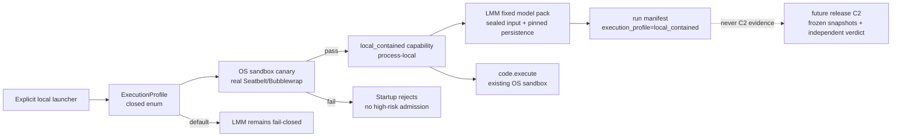

# Frozen Context Pack

Line: `local-contained-execution`
Baseline SHA: `0251f0a30d984bdbb2cfab404e6c646deab60cae`

## Objective
# Local Contained Development Mode — design

## Status and decision

**Approved for planning; not implemented yet.**

The target macOS host has now demonstrated that Seatbelt is usable from its
native Terminal: `sandbox-exec` launched successfully, the sandbox and
`code.execute` suite passed (33 tests), and the native full gate reported
`GATE PASSED`.  The earlier `sandbox_apply: Operation not permitted` result
describes the nested Codex-managed environment, not the user's Mac.

The product therefore gains an explicitly selected local-development profile:
`local_contained`.  It is not a relaxed or unsandboxed mode.  It enables the
locally useful LMM flow, keeps `code.execute` behind the existing OS sandbox,
and requires a fresh local canary before high-risk execution is admitted.
It does **not** create C2 candidate-evaluation evidence or weaken C2's frozen
exact-Git, trusted-runtime, hostile-ingestion, and independent-verdict rules.

## Goals

1. A normal start remains fail-closed for LMM execution, exactly as today.
2. Each local-development start must opt in explicitly to
   `local_contained`; no configuration file, prior run, or browser state may
   silently re-enable it.
3. Under `local_contained`, the registered LMM pack may execute in the local
   Workbench process after its existing sealed-input and persistence admission
   checks.  It is labelled local-development execution, never C2 execution.
4. `code.execute` remains a separately sandboxed, typed high-risk operation.
   `local_contained` requires an actual Seatbelt/Bubblewrap canary before it
   may be used; a discovered binary, unit-test fake, or environment variable
   alone is insufficient.
5. Every run records the selected profile and the resulting UI/API state makes
   the active profile visible.  Records from this profile cannot satisfy C2 or
   release-evaluation gates.

## Explicit startup contract

The supported local entry point is a checked-in launcher:

```bash
./scripts/run-local-contained.sh
```

It exports `WORKBENCH_EXECUTION_PROFILE=local_contained` only to the launched
Workbench process.  The server parses this value through a closed enum:

| Value | Meaning |
| --- | --- |
| unset or `default` | LMM remains rejected with `LMM_FROZEN_CONTAINMENT_REQUIRED`; no local capability is active. |
| `local_contained` | Startup runs the local containment canary.  A passed receipt admits local LMM and enables the existing sandboxed `code.execute` path. |
| any other value | Startup fails with a structured invalid-profile error. |

The launcher must never write a persistent shell profile or an application
settings file.  Closing the process ends the opt-in.  Direct users of Uvicorn
may set the same variable deliberately, but receive the same startup canary;
the environment value alone is not an admission capability.

## Components and data flow



### Execution-profile service

Add a small backend-owned `ExecutionProfile` service.  It owns parsing,
startup admission, immutable process-local status, profile-specific structured
errors, and a serializable safe status view for `/health`.  It must not accept
request parameters, browser input, or a per-run override.  Its only active
capability is constructed after the canary returns a passed receipt.

The service publishes only these safe facts: `profile`, `lmm_admitted`,
`high_risk_code_admitted`, and `canary_status`.  It never exposes a rendered
sandbox profile, host paths, child environment, or internal capability token.

### Local containment canary

The canary is separate from C2 and intentionally narrower.  It exercises the
same `run_python_sandboxed` production path that `code.execute` uses and must
prove all of the following on this process start:

* a fixed harmless script runs successfully;
* a write outside its declared output directory is denied;
* network access is denied; and
* its declared output directory is writable.

Missing backend, profile-application failure, malformed output, timeout, or
any failed assertion yields `LOCAL_CONTAINMENT_CANARY_FAILED`.  The server does
not start with `local_contained` active in that case.  Existing `code.execute`
still independently fails closed if its own sandbox invocation later fails.

### LMM admission

Replace the unconditional LMM rejection at both shared entry boundaries
(`run_service` and direct synchronous orchestrator invocation) with one
profile-owned `require_lmm_local_or_c2_admission` decision:

* default profile retains `LMM_FROZEN_CONTAINMENT_REQUIRED` before upload or
  run creation;
* passed `local_contained` permits the existing fixed LMM pack to continue
  through its sealed-input, model-options binding, and pinned-persistence
  state machine; and
* a future C2 integration adds a third admission source without changing the
  local profile's truth claim.

The local LMM path does not execute caller-provided Python, shell commands, or
untrusted package paths.  It invokes the already registered, fixed
`linear_mixed_effects` pack using the Workbench interpreter.  This is adequate
for local development, but is explicitly not the separate hostile-candidate
evaluator promised by C2.

### Provenance and presentation

Each admitted local LMM run writes an immutable manifest fact:

```json
{
  "execution_profile": "local_contained",
  "containment_evidence": "local_startup_canary",
  "release_evaluation_eligible": false
}
```

The health response exposes the profile status.  The frontend shows a persistent
non-dismissable local-development banner when the profile is active, explaining
that LMM is locally enabled and the run is not C2/release evidence.  It shows
no banner in the default profile.

## Errors and safety invariants

* `LMM_FROZEN_CONTAINMENT_REQUIRED` remains the default-profile error for
  compatibility with existing clients and tests.
* `LOCAL_CONTAINMENT_PROFILE_INVALID` is a startup configuration error.
* `LOCAL_CONTAINMENT_CANARY_FAILED` contains a bounded reason but no host path,
  profile text, or secret-bearing environment detail.
* A failed canary cannot fall back to host Python, disable the existing
  `code.execute` sandbox, or create an LMM run.
* A local receipt is process-local and dies with the server.  It cannot be
  serialized, replayed, supplied by a client, or copied into C2 evidence.
* C2 policy code is not modified to accept user-owned virtualenvs or this
  local profile.  C2 remains independently fail-closed until its exact-host
  policy and fresh canary requirements are met.

## Test and acceptance plan

1. Unit tests prove closed parsing, default rejection, invalid profile refusal,
   canary failure refusal, and successful local admission only after a passed
   canary.
2. Integration tests prove both LMM entry boundaries retain the pre-materialize
   rejection by default and permit the sealed LMM lifecycle only under an
   injected passed local profile.
3. Sandbox tests run the real canary assertion harness where Seatbelt is
   available; deterministic fakes cover non-native CI paths without claiming
   host acceptance.
4. HTTP tests prove health exposes safe status and local LMM manifests carry
   non-release provenance.
5. Frontend tests prove the banner appears only for active local mode.
6. On the native Mac, run targeted profile/LMM/code-execute tests, then
   `WORKBENCH_PYTHON=/Users/jiayuanren/项目规划/.venv/bin/python bash scripts/gate.sh --full`.
   Record the exact result in the release ledger and the formal FMS event
   stream.  Browser acceptance must submit an LMM run in this explicit mode
   and inspect its result/provenance; it may not call the result C2 evidence.

## Non-goals

* No relaxed `local_trusted` or unsandboxed `code.execute` switch.
* No persistent opt-in, browser-side opt-in, or request-side override.
* No generic arbitrary-package execution.
* No assertion that local LMM output, the local canary, or the full local gate
  is a C2 verdict or release sign-off.
* No change to the C2 trusted-runtime ownership rules.

## Boundary
- Affected paths: `backend/workbench/services/execution_profile.py`, `backend/workbench/services/run_service.py`, `backend/workbench/orchestrator/__init__.py`, `backend/workbench/orchestrator/_manifest.py`, `scripts/run-local-contained.sh`, `tests/test_execution_profile.py`, `tests/models/linear_mixed_effects/test_lmm_admission_state.py`, `tests/test_lmm_extension_seams.py`, `tests/test_lmm_local_contained_smoke.py`, `docs/superpowers/specs/2026-07-20-local-contained-development-mode-design.md`, `docs/superpowers/plans/2026-07-20-v1.7.3-final-assembly-and-local-smoke.md`, `docs/superpowers/release-trains/v1.7.3/release-ledger.json`, `docs/superpowers/release-trains/v1.7.3/evidence/local-lmm-smoke.md`
- Allowed paths: `backend/workbench/services/execution_profile.py`, `backend/workbench/services/run_service.py`, `backend/workbench/orchestrator/__init__.py`, `backend/workbench/orchestrator/_manifest.py`, `scripts/run-local-contained.sh`, `tests/test_execution_profile.py`, `tests/models/linear_mixed_effects/test_lmm_admission_state.py`, `tests/test_lmm_extension_seams.py`, `tests/test_lmm_local_contained_smoke.py`, `docs/superpowers/specs/2026-07-20-local-contained-development-mode-design.md`, `docs/superpowers/plans/2026-07-20-v1.7.3-final-assembly-and-local-smoke.md`, `docs/superpowers/release-trains/v1.7.3/release-ledger.json`, `docs/superpowers/release-trains/v1.7.3/evidence/local-lmm-smoke.md`
- Protected paths: none
- Dependencies: none
- Tests: none
- Known gates: `local-contained-native-gate`, `full-release-gate`

## Rules
```json
{"candidate_rules":[],"candidate_rules_sha256":"4f53cda18c2baa0c0354bb5f9a3ecbe5ed12ab4d8e11ba873c2f11161202b945","global_rules":{"rules":[],"schema_version":1},"global_rules_sha256":"994a863c694e05021d65d0f8b862f24a28da461080286b7b35d1695ee0775fdc","rules_sha256":"c43d07b614106c511776da60664c80b2b1d5f27cc62ddece26aa4e6761474c5c"}
```

## Selected historical lessons
No matching completed retrospective was selected.
