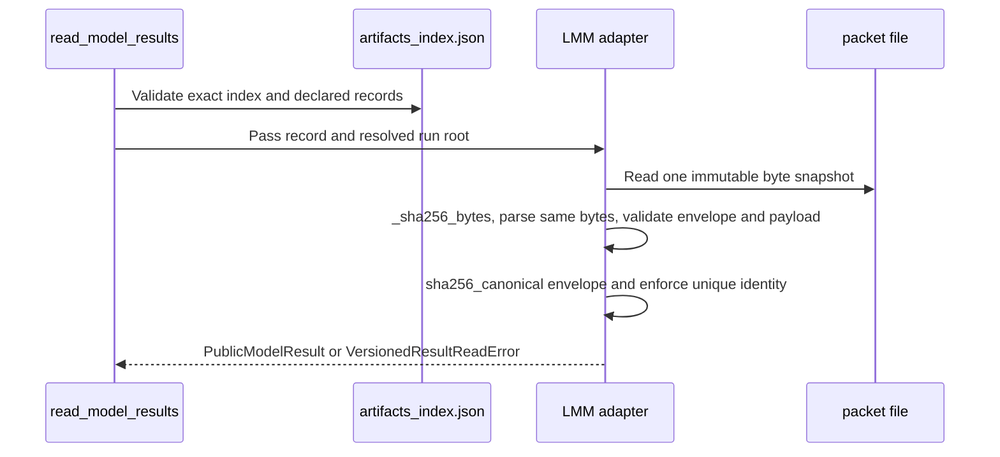

# LMM Public Result Adapter Design

Date: 2026-07-19

Status: revision proposal pending spec review. There is no runtime or stage registration, Pack registry
entry, candidate merge, LMM-specific route, Agent recipe/proposal/execution, UI feature registration,
Compare dispatch, browser claim, or release claim.

## Boundary and Observable Effect

The foundation implementation makes a verified persisted LMM result readable through
`read_model_results` without changing historical OLS result semantics.
Because the existing generic HTTP `model_results` response already calls that reader, it will
surface the verified LMM `PublicModelResult`; no new or LMM-specific HTTP route is added.
No Agent, UI, or Compare feature is registered.
The existing OLS-specific analysis-loop resolver continues rejecting or non-dispatching LMM until a
later explicit analysis-loop adapter exists.

## Persisted Source of Truth

Each terminal LMM fit, including a terminal failed fit, persists exactly one strict C1
`PacketEnvelope` at the controlled producer-owned run-relative path
`artifacts/model_results/linear_mixed_effects_1.result.json`.
The envelope fields are `contract="linear_mixed_effects.result"` and
`contract_version="1.0"`; `linear_mixed_effects.result@1.0` is display shorthand only.
Its payload is the normalized terminal `LmmResultPayloadV1`, and exactly one index record registers
that path as `artifact_type="model_result_packet"`.
Standalone diagnostic and recovery artifacts remain distinct artifact types: they are not terminal
result packets and the adapter never projects them into `model_results`. The terminal payload may
retain its normalized diagnostic summary, but it cannot be replaced by a diagnostic or recovery file.
An input-blocked attempt is not a terminal fit: if preflight, input validation, or preparation rejects
before `_fit_prepared` is invoked, WO-B writes only a C1 diagnostic with `severity="error"`,
`status="blocked"`, and no action candidate, and registers no `model_result_packet`. Once
`_fit_prepared` is invoked, every terminal outcome writes exactly one envelope at the controlled path:
a returned fit failure writes `status="failed"`; an unexpected
`_fit_prepared` exception is caught by `runner.py`, converted to a sanitized failed C1 diagnostic with
code `LMM_UNEXPECTED_FIT_EXCEPTION`, `severity="error"`, `status="failed"`, and
`action_candidate:null`, and also writes that same terminal failed envelope. Exception
text, traceback, and provider internals are never persisted. A failed terminal envelope is therefore
not interchangeable with input-blocked diagnostic-only output.
A bare legacy payload, coefficient derivative, or separately mutable public result is forbidden.
No legacy artifact is converted or rewritten at rest.

## Exact LmmResultPayloadV1

Later `backend/workbench/services/lmm_result_adapter.py` enforces this contract through
`parse_lmm_result_payload_v1`. It rejects booleans as numbers, non-finite numbers, and every extra or
missing key. The common top-level fields are exactly:

| Field | Exact rule |
| --- | --- |
| `schema_version`, `contract_version` | integer literal `1`; string literal `"1.0"` |
| `estimator_version` | literal `"statsmodels_mixedlm_v1"` |
| `model_id`, `model_type`, `engine` | literals `"linear_mixed_effects_1"`, `"linear_mixed_effects"`, `"statsmodels"` |
| `fit_method`, `converged`, `status`, `optimizer` | `"reml" | "ml"`; bool; `"complete" | "failed"`; literal `"lbfgs"` |
| `nobs`, `n_groups`, `excluded_rows` | nonnegative integers; for complete results the first two are positive |
| `observations_per_group` | exact object from nonempty group label to positive integer; values sum to `nobs` |
| `exclusion_counts` | exact object from nonempty column name to nonnegative integer; values sum to `excluded_rows` |
| `fixed_effects_formula` | nonempty string |
| `random_effects_specification` | nonempty string |
| `reference_group`, `comparison_group` | distinct nonempty strings |
| `result_identity` | 64 lowercase hexadecimal characters |
| `primary_target_id` | literal `"group_time_interaction"` |
| `coefficients`, `random_effects` | state-dependent exact objects below |
| `diagnostics` | array of exact C1 `LmmDiagnostic` values |
| `figure_context` | canonical object for complete except the exact unbalanced-time warning case below; null for failed |
| `warnings` | unique diagnostic warning codes in diagnostic order |

A complete object has `converged=true` and its `coefficients` has exactly one key,
`group_time_interaction`, whose value has exactly
`result_id="group_time_interaction"`, nonempty `label`, finite `estimate`, nonnegative finite
`std_error`, finite `p_value` in `[0,1]`, `confidence_interval=[lower,upper]` with two finite ordered
numbers, `confidence_level=0.95`, `inference_method="asymptotic_wald_z_v1"`, and
`source_id="model_results.linear_mixed_effects_1.coefficients.group_time_interaction"`.

For a complete result, `random_effects` has exactly `intercept_variance`, `slope_variance`,
`covariance`, `intercept_slope_covariance`, `residual_variance`, `n_groups`, and
`observations_per_group`. Intercept and residual variances are finite and nonnegative. Slope variance
is a finite nonnegative number or null. `intercept_slope_covariance` is the sole canonical semantic
field; `covariance` is a required v1 compatibility alias. They must be numerically exactly equal as
the same finite number or both null, and the parser rejects inequality. No consumer may assign or
select different meanings for the two fields. All three nullable values are null for an
intercept-only specification and all are numeric for a random-slope specification. Its positive
integer `n_groups` equals the top-level count, and its group-to-positive-integer
`observations_per_group` mapping equals the top-level mapping exactly and sums to `nobs`.

Each diagnostic has exactly `code`, `severity`, `status`, `evidence`, and `action_candidate` and is
validated by the existing C1 `LmmDiagnostic`: code is nonempty; severity is `info|warning|error`;
status is `complete|blocked|failed`; evidence is a JSON object; action candidate is null or the exact
C1 confirmed-recovery object. `warnings` equals, without additions or omissions, the ordered list of
codes for diagnostics whose severity is `warning`.

The V1 terminal-result diagnostic-code allowlist is exactly
`{LMM_CONVERGENCE_FAILED, LMM_UNEXPECTED_FIT_EXCEPTION, LMM_RANDOM_SLOPE_NEAR_ZERO,
LMM_RANDOM_EFFECTS_SINGULAR, LMM_FIGURE_CONTEXT_UNAVAILABLE_UNBALANCED_TIME}`. The first two are
`error/failed/action_candidate:null`; the latter three are `warning/complete`, with the unbalanced-time
code requiring `action_candidate:null` and the existing C1 recovery rule governing the two random-effect
warnings. Input-blocked codes are not terminal-result codes. The backend parser and the WO-C view model
must use this identical closed set; any other terminal diagnostic code is rejected.

For `status="complete"`, `figure_context` is non-null except in one scientifically constrained state:
it is null if and only if diagnostics contains the required warning
`LMM_FIGURE_CONTEXT_UNAVAILABLE_UNBALANCED_TIME`, with `severity="warning"`, `status="complete"`,
and no action candidate. There is exactly one diagnostic with this code and exactly one matching
`warnings` entry; independent warning diagnostics and entries may coexist. Its evidence is exactly
`{reason,group_support,first_nonshared_time}`: `reason` is literal
`"unbalanced_observed_time_support"`; `group_support` is exactly a two-item array ordered
lexicographically by distinct label, with exact item keys `{label,observed_time_sha256}`. Each label is
1--128 characters and each digest is `sha256_canonical(sorted observed-time number array)` rendered as
64 lowercase hexadecimal characters. `first_nonshared_time` is the least numeric member of the
symmetric difference of those two sorted supports and is finite. The digests must differ. This bounded
evidence establishes that canonical alignment would lose observations or fabricate values without
embedding unbounded raw rows. Producer tests independently recompute the full supports, canonical
hashes, and least difference. Because the packet contains hashes rather than full supports, the adapter
validates only representable closed invariants: exact evidence keys, two labels of length 1--128 in
lexical order, two 64-lower-hex digests that differ, finite `first_nonshared_time`, exactly one matching
diagnostic, and exactly one matching warning entry. It does not claim to recompute hidden supports. The
producer and adapter must not truncate, impute, interpolate, or otherwise manufacture a trajectory.
The model result remains valid; it is complete but non-trajectory.

A failed object has `converged=false`, `coefficients:{}`, `random_effects:{}`,
`figure_context:null`, and `warnings:[]`. It contains at least one diagnostic with
`severity="error"` and `status="failed"`. No partial estimates or inferred statistics are allowed.

## Canonical FigureContext

The only non-null figure value is exactly
`{chart_type:"lmm_group_trajectory",time:number[],groups:[{label:string,observed_mean:number[],fitted_mean:number[]}]}`.
It has exact keys at both levels, `chart_type="lmm_group_trajectory"`, a nonempty strictly
increasing finite `time` array, and a nonempty `groups` array.
Group labels are nonempty and unique; both mean arrays contain only finite numbers and each length
equals `time.length`.
FigureContext exists only in the envelope payload and is neither separate nor synthesized.
WO-B must replace `series/group/fitted_marginal_mean` with this shape before integration.
Integration does not translate between those formats.

## WO-B Work Order

`backend/workbench/engine/packs/linear_mixed_effects/runner.py` owns terminal persistence: after
successful preparation it invokes `_fit_prepared`, writes the one complete-or-failed envelope at
`artifacts/model_results/linear_mixed_effects_1.result.json`, and registers that exact path once as
`model_result_packet` using `ArtifactRecord.to_dict()`. It catches only unexpected exceptions crossing
the `_fit_prepared` boundary to produce the sanitized terminal failure above; it does not turn
input-blocked validation/preparation into a result packet.

`backend/workbench/engine/packs/linear_mixed_effects/result.py` owns the exact terminal payload. It
removes top-level `result_id`, `estimate`, and `inference_method`; those values exist only at
`coefficients.group_time_interaction`. It builds complete and failed payloads without UI projections.

`backend/workbench/engine/packs/linear_mixed_effects/figures.py` owns FigureContext. It emits the
canonical shape only when every displayed group has identical sorted observed-time support. If any
support differs, it emits no figure and returns the one bounded unbalanced-time warning described
above; it never truncates, imputes, interpolates, or emits legacy `series` data.

`tests/models/linear_mixed_effects/test_runner.py` must first add RED producer tests for the controlled path and single
registration, input-blocked diagnostic-only output, returned terminal failure, unexpected
`_fit_prepared` exception, removed top-level fields, balanced canonical figures, and unbalanced null
figures with exact evidence. Only then may WO-B change runner, result, or figures.

## WO-C Presentation Adapter Contract

WO-C receives only the verified `PublicModelResult` server projection. Its outer metadata is always
present and trusted as projected by the server: `artifact_id`, `artifact_path`, `artifact_sha256`,
`model_id`, `model_type`, `source_contract`, `source_contract_version`, `source_producer_version`,
`source_packet_digest`, and `legacy_compatibility`. WO-C does not read an artifact file, recompute a
digest, or substitute client-derived identity.

The only primary coefficient display source is
`payload.coefficients.group_time_interaction`; there are no top-level payload `result_id`, `estimate`,
or `inference_method` fields and no fallback lookup is permitted. The presentation adapter exposes
three data states: complete with trajectory; complete without trajectory only for the exact
`LMM_FIGURE_CONTEXT_UNAVAILABLE_UNBALANCED_TIME` warning case; and failed with no trajectory.
It may display server-projected metadata, coefficient values, status, and diagnostics, but cannot
compute conclusions, create recovery proposals, or execute recovery. This is a data-presentation
contract, not UI feature registration.

WO-C owns the only integration consumer: a read-only, non-registered adapter in
`frontend/src/workbench/repeatedMeasures/repeatedMeasuresViewModel.ts`; it accepts only a structurally
complete `PublicModelResult` outer object and rejects a raw `PacketEnvelope`. It requires nonempty
string outer metadata, 64-lower-hex `artifact_sha256` and `source_packet_digest`, and exact
`legacy_compatibility="projected_from_versioned_packet"`; it checks structure only and never
recomputes a digest, hash, path, identity, coefficient, or diagnostic conclusion. The diagnostic
allowlist is the existing C1 LMM diagnostic-code set plus
`LMM_FIGURE_CONTEXT_UNAVAILABLE_UNBALANCED_TIME`; an unknown code is rejected by the view model.
`frontend/src/workbench/repeatedMeasures/PacketPanel.tsx` renders trusted metadata and the nested
coefficient only. `frontend/src/workbench/repeatedMeasures/Trajectory.tsx`
renders only canonical FigureContext and renders an explicit unavailable state for the exact warning.
The diagnostics allowlist includes `LMM_FIGURE_CONTEXT_UNAVAILABLE_UNBALANCED_TIME`; no recovery,
Agent action, or execution control is exposed.

WO-C tests are `repeatedMeasuresViewModel.test.ts`, `PacketPanel.test.tsx`, and `Trajectory.test.tsx`,
with `frontend/src/workbench/repeatedMeasures/__fixtures__/publicModelResults.ts`. They cover complete
trajectory, exact complete non-trajectory, failed including `LMM_UNEXPECTED_FIT_EXCEPTION`, raw-envelope
rejection, missing/malformed outer metadata, absent nested coefficient, unknown diagnostic code, and
absence of recovery/Agent execution. The proposed parallel
`frontend/src/features/repeated-measures/...` path is explicitly superseded and must not be introduced;
a regression test asserts this remains the only integration consumer.

## Artifact-Index Protocol and Atomic Read

The sole index for a versioned result is `<run_root>/artifacts_index.json`, with
exact top-level shape `{"schema_version":1,"artifacts":[...]}`. A V1 run may
also have an unversioned artifact index that contains only legacy non-model
records. The adapter reads that index through the same pinned descriptor path,
but if it contains no record whose exact `artifact_type` is
`"model_result_packet"`, it contributes no versioned projection and does not
alter legacy OLS reading. Once any record declares `model_result_packet`, the
entire index must satisfy the exact versioned shape below; an unversioned,
malformed, or unsupported declared packet fails closed.
Each indexed LMM terminal-result `ArtifactRecord` has exactly: `artifact_id` as nonempty string;
`path` as normalized run-relative POSIX path; `artifact_type="model_result_packet"`; `step` as
nonempty string; `sha256` as 64 lowercase hexadecimal characters; `inputs` as an array of nonempty
strings; `config_hash` as a string, including the accepted empty string; and `code_version` as
nonempty string. This is the exact genuine `ArtifactRecord.to_dict()` shape, so `config_hash` is
required in every indexed terminal-result record even though this adapter does not assign it LMM
result semantics. Diagnostic and recovery records retain the same general ArtifactRecord shape with
their own non-model artifact types. Existing index names are not renamed in storage.

`path` must be nonempty, normalized, run-relative POSIX, and at most 512 UTF-8 bytes; it contains no
`.` or `..` segment. The adapter resolves it against the resolved run root, rejects absolute paths,
symlink escape, any resolved target outside the root, and any target that is not a regular file.
For a malformed or oversized path it exposes no raw path in `VersionedResultReadError`; otherwise the
same bounded normalized indexed path may be exposed. This produces stable bounded errors and prevents
attacker-controlled path text from amplifying an error response.
It reads the target exactly once into one immutable byte snapshot.
`_sha256_bytes(snapshot)` must equal indexed `sha256`; JSON parsing and envelope validation consume
that same snapshot, with no second file read after hashing.
`source_packet_digest` is `sha256_canonical(parsed_exact_envelope)`, using the C1 canonical JSON
serializer, and is distinct from the byte-level file digest.

The valid envelope must have the exact known C1 envelope fields and the exact contract and version
above before its payload parser runs.
Every declared `model_result_packet` is authoritative: an unknown model-result-packet contract or
version is an error, never silently ignored.
Every declared LMM terminal `model_result_packet`, including a failed terminal packet, must use exactly
`artifacts/model_results/linear_mixed_effects_1.result.json`; a second LMM terminal record, a
model-result record at any other path, or a diagnostic/recovery artifact declared as
`model_result_packet` is invalid.
`model/lmm_result.json` is specifically unacceptable for new LMM production artifacts. The adapter's
generic bounded containment checks remain useful for all index input, but they do not relax this fixed
new-production LMM path rule.
Unrelated JSON not declared in the index as `model_result_packet` remains ignored exactly as before.

Identity is exactly `(source_contract, source_contract_version, model_id)`.
There must be exactly one matching indexed artifact for each such identity; zero cannot produce a
result and more than one raises a duplicate error.
Any invalid declared LMM `model_result_packet` causes the whole `read_model_results` call to raise.
Validated LMM projections are ordered lexicographically by verified `artifact_path` and appended
after the unchanged legacy OLS subsequence; OLS payload content and relative order remain unchanged.

## PublicModelResult Projection

The adapter projects index `path` and `sha256` to public `artifact_path` and `artifact_sha256`.
It returns one object with required fields `artifact_id`, `artifact_path`, `artifact_sha256`,
`model_id`, `model_type`, `source_contract`,
`source_contract_version`, `source_producer_version`, `source_packet_digest`, `payload`, and
`legacy_compatibility="projected_from_versioned_packet"`.
`payload.coefficients` is only a read-time view of the envelope payload.
Nothing is recalculated, repaired, separately persisted, or independently mutable.

## VersionedResultReadError

All versioned packet failures raise `VersionedResultReadError(code, artifact_path)`.
`artifact_path` is the bounded normalized indexed path only when valid, otherwise null.
The closed stable `code` set is:

| Code | Condition |
| --- | --- |
| `ARTIFACT_INDEX_INVALID` | index shape, version, record fields, or duplicate artifact_id invalid |
| `ARTIFACT_PATH_INVALID` | path invalid, escaping, missing, symlinked, or not a regular file |
| `ARTIFACT_SHA256_MISMATCH` | `_sha256_bytes(snapshot)` differs from indexed digest |
| `PACKET_JSON_INVALID` | immutable snapshot is not one JSON object |
| `PACKET_ENVELOPE_INVALID` | C1 envelope shape or required metadata is malformed |
| `UNKNOWN_MODEL_RESULT_PACKET_CONTRACT` | declared packet contract or version is unsupported |
| `LMM_PAYLOAD_INVALID` | strict payload, nested schema, state, or figure invariant fails |
| `LMM_DUPLICATE_IDENTITY` | more than one indexed artifact has the same exact identity |

The service exposes only the stable code and bounded artifact path, does not include packet bytes or
arbitrary parser text, does not fall back, and does not return a partial `model_results` list.

## Read Sequence

## Decision Table

| Condition | Result |
| --- | --- |
| Valid indexed LMM packet | Surface once through reader and existing generic HTTP response |
| Complete result with canonical figure | Present complete trajectory state |
| Complete result with exact unbalanced-time warning and null figure | Present complete non-trajectory state; never synthesize a series |
| Complete result with null figure for any other reason | Raise stable versioned read error |
| Failed terminal result | Present failed non-trajectory state |
| Legacy OLS result | Preserve content and relative order |
| V1 unversioned index with no declared model packet | Preserve legacy OLS reading and add no projection |
| Bare, malformed, unknown, or wrong-version declared packet | Raise stable versioned read error |
| Bad path, file digest, payload, figure, or duplicate identity | Raise; no partial list |
| Unindexed unrelated JSON | Ignore exactly as before |
| OLS analysis-loop request for LMM | Continue rejecting or non-dispatching |

## Tests and Later File Map

`backend/tests/test_lmm_result_adapter.py` covers exactly one controlled terminal complete and failed
WO-B envelope, separate diagnostic/recovery artifacts excluded from model results, exact common and
state-specific keys, coefficient-only primary display fields, numeric random effects, C1 diagnostics
and warning consistency, rejection when `covariance` differs from `intercept_slope_covariance`,
canonical figure validation, the one permitted null-figure unbalanced-time warning state, rejection
of every other complete/null-figure state, and no truncate/impute/interpolate behavior. It also covers
bare/malformed/unknown packets, exact index records, path containment, one snapshot read,
`_sha256_bytes` mismatch, canonical digest, mutation, the required `config_hash`, oversized-path
rejection with no raw-path echo, stable errors, and duplicate exact identity.
`backend/tests/test_results_service.py` covers one visible LMM result, whole-read atomic failure,
unknown declared contract failure, deterministic LMM path order, unchanged OLS content/order,
ignored unrelated JSON, and no statistics recomputation.
WO-B result/figure tests must reject its old series shape, independently verify the exact unbalanced
support-hash algorithm, emit the canonical shape when it is scientifically representable, and emit only
the stable unbalanced-time warning when it is not.
WO-C presentation-contract tests must use the named view-model, panel, trajectory, and fixture files;
they trust outer metadata, read only the nested primary coefficient, allow the stable unbalanced-time
diagnostic, reject raw envelopes, and distinguish complete-trajectory, complete-non-trajectory, and
failed states without conclusions or recovery/Agent execution.

Later implementation is limited to `backend/workbench/services/results_service.py`, new
`backend/workbench/services/lmm_result_adapter.py`, the two named backend tests, WO-B
shape-correction tests, and WO-C presentation-contract tests. The latter verify data presentation
only and do not authorize a UI feature registration.
Negative tests prove no Pack registry, stage registration, LMM-specific route, Agent
recipe/proposal/execution, UI feature registration, or Compare dispatch, and prove the OLS-specific
analysis-loop resolver still does not accept LMM.

## Acceptance and Exit Conditions

Acceptance requires the strict envelope and frozen WO-B payload as the sole new-run source of truth;
the repository index names and one-snapshot `_sha256_bytes` verification; closed stable errors and
whole-read atomic failure; one exact identity; required public fields; read-time-only coefficients;
one controlled terminal packet for complete and failed fits, complete/failed invariants, numeric
random effects, diagnostic/warning consistency, canonical figure and its sole unbalanced-time null
exception; no series translation, truncation, imputation, or interpolation;
exact `ArtifactRecord.to_dict()` records including `config_hash`, bounded normalized artifact paths
with no raw-path error amplification, deterministic LMM order with unchanged OLS semantics; generic
HTTP visibility; trusted outer-metadata/nested-coefficient WO-C presentation states; and all positive
and negative tests above.

The proposal exits spec review only after the focused tests prove the terminal packet, canonical or
scientifically unavailable figure state, and WO-C presentation contract. The implementation foundation
then exits only after those tests pass and WO-B emits the canonical shape where representable.
Exit adds no LMM-specific route or downstream feature registration and does not authorize a candidate
merge, browser claim, release, or release-readiness claim.
